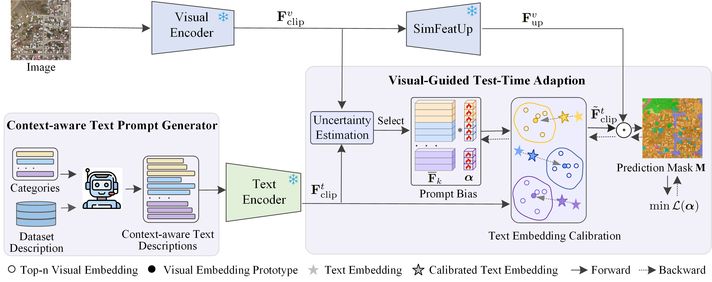
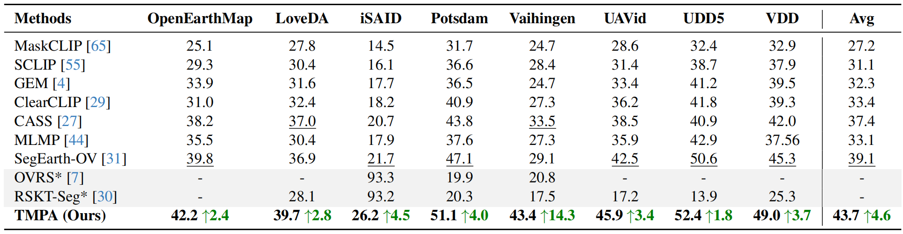
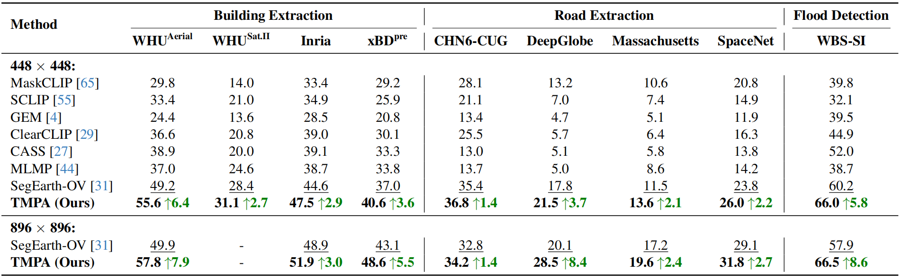

<h1 align="center">
  <a href="https://cvpr.thecvf.com/virtual/2026/poster/39265">
    
  </a>
  Test-Time Multi-Prompt Adaptation for Open-Vocabulary Remote Sensing Image Segmentation
</h1>

<h2 align="center"> 
  🌟 CVPR 2026 🌟
</h2>

<p align="center">
  
</p>

## Abstract

> The rise of vision-language models (VLMs) has driven the initial exploration of open-vocabulary remote sensing image semantic segmentation (OVRSIS), enabling recognition of unseen categories in complex Earth observation scenes. However, existing methods primarily focus on enhancing visual representations of domain-specific remote sensing images, while overlooking the effect of textual information. In this paper, we argue that there exists a crucial issue of textual ambiguity in OVRSIS task, limiting final segmentation performance. Therefore, we propose a plug-and-play yet effective Test-time Multi-Prompt Adaptation (TMPA) method to mitigate textual ambiguity in OVRSIS. Specifically, TMPA first generates diverse, context-aware descriptions for each category instead of the naive class name by executing a large language model with a task-driven prompt, which can effectively avoid some textual ambiguity, i.e., background class has different meanings in various tasks. Furthermore, TMPA develops a visual-guided test-time adaptation strategy for the generated multi-prompts, which adaptively refines the prompt representations of each category with high-confidence visual features for the uncertain predictions with high entropy, making TMPA better applicable to different scenarios. Particularly, a pixel-level loss with entropy minimization is proposed to optimize the text prompt with a bias during inference, where prompt bias is constructed based on a weighted combination of high-confidence visual features. Our TMPA can be flexibly integrated into existing methods for boosting their performance. Extensive experiments are conducted on 17 remote sensing datasets, and the results show our TMPA can significantly improve its counterparts, while achieving state-of-the-art performance.

## Dependencies and Installation

```
# 1. install SimFeatUp
# refer to https://github.com/likyoo/SimFeatUp

# 2. git clone this repository
git clone https://github.com/dawndaa/TMPA.git
cd TMPA

# use the CTTA + DAF integration branch
git switch --track origin/feature/ctta-daf-integration

# 3. create new anaconda env
conda create -n TMPA python=3.8
conda activate TMPA

# install torch and dependencies
pip install -r requirements.txt
# The dependent versions are not strict, and in general you only need to pay attention to mmcv and mmsegmentation.
```

## Datasets

We include the following dataset configurations in this repo:

1) `Semantic Segmentation`: OpenEarthMap, LoveDA, iSAID, Potsdam, Vaihingen, UAVid<sup>img</sup>, UDD5, VDD
2) `Building Extraction`: WHU<sup>Aerial</sup>, WHU<sup>Sat.Ⅱ</sup>, Inria, xBD<sup>pre</sup>
3) `Road Extraction`: CHN6-CUG, DeepGlobe, Massachusetts, SpaceNet
4) `Water Extraction`: WBS-SI

Please refer to [dataset_prepare.md](https://github.com/likyoo/SegEarth-OV/blob/main/dataset_prepare.md) for dataset preparation.

## Model evaluation

```
bash TMPA.sh
```

Results will be saved in `save_result/`.

## Standalone CTTA + DAF integration

The `feature/ctta-daf-integration` branch contains the CTTA protocol and DAF-derived stabilization modules used in this project.

A separate DAF clone is **not required**. The relevant corruption implementation is vendored under:

```text
ctta/vendor/daf_imagecorruptions/
```

The evaluator supports:

```text
source / episodic / domain / continual
Source Consistency
Prompt Feature Consistency
CMAC
Temporal SAFS
```

Minimal CTTA smoke test:

```bash
CUDA_VISIBLE_DEVICES=0 python ctta_eval_remote.py /path/to/data \
  --test_sets loveda \
  -a ViT-B/16 \
  -b 1 \
  --gpu 0 \
  --lr 1e-4 \
  --tta_steps 1 \
  --num_classes 7 \
  --name_path ./configs/cls_loveda.txt \
  --text_shift --do_shift --per_label \
  --text_adjust True \
  --reset_mode continual \
  --corruptions_list gaussian_noise \
  --corruption_severity 5
```

Then replace `gaussian_noise` with `common` for the full 15-domain corruption stream.

See `docs/standalone_ctta.md` and `docs/ctta_protocol.md` for the protocol, module flags and ablation setup.

## Results

<p align="center">
  
</p>

<p align="center">
  
</p>

## Citation

```
@inproceedings{yang2026test,
  title={Test-Time Multi-Prompt Adaptation for Open-Vocabulary Remote Sensing Image Segmentation},
  author={Yang, Ting and Wang, Qilong and Hou, Qibin and Hu, Qinghua},
  booktitle={Proceedings of the IEEE/CVF Conference on Computer Vision and Pattern Recognition},
  pages={10699--10709},
  year={2026}
}
```

## Acknowledgement

This implementation is based on [SegEarth-OV](https://github.com/likyoo/SegEarth-OV) and [TPS](https://github.com/elaine-sui/TPS). The CTTA branch additionally vendors DAF-derived corruption code under its MIT licence. Thanks for the awesome work.
